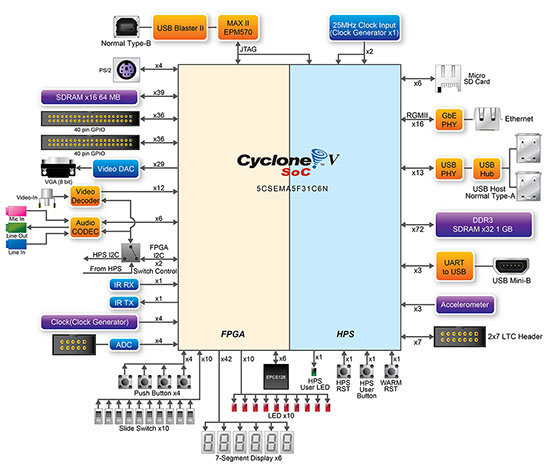
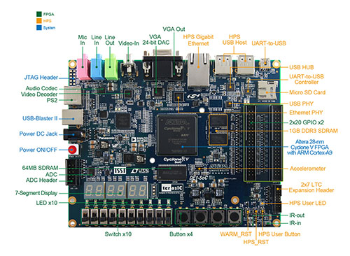
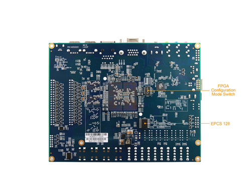
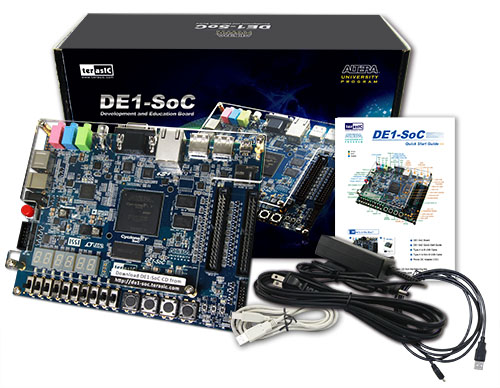

# DE1-SoC Development Board

## Overview

The **DE1-SoC** Development Kit presents a robust hardware design platform built around the Altera System-on-Chip (SoC) FPGA, which combines the latest dual-core Cortex-A9 embedded cores with industry-leading programmable logic for ultimate design flexibility. Users can now leverage the power of tremendous re-configurability paired with a high-performance, low-power processor system. Altera’s SoC integrates an ARM-based hard processor system (HPS) consisting of processor, peripherals and memory interfaces tied seamlessly with the FPGA fabric using a high-bandwidth interconnect backbone. The DE1-SoC development board includes hardware such as high-speed DDR3 memory, video and audio capabilities, Ethernet networking, and much more.  
The **DE1-SoC** Development Kit contains all components needed to use the board in conjunction with a computer that runs the Microsoft Windows XP or later (64-bit OS and Quartus II 64-bit are required to compile projects for DE1-SoC). 

 

## Specifications

The DE1-SoC board has many features that allow users to implement a wide range of designed circuits, from simple circuits to various multimedia projects.

The following hardware is provided on the board:

###FPGA Device

* Cyclone V SoC 5CSEMA5F31C6 Device
* Dual-core ARM Cortex-A9 (HPS)
* 85K Programmable Logic Elements
* 4,450 Kbits embedded memory
* 6 Fractional PLLs
* 2 Hard Memory Controllers

###Configuration and Debug

* Serial Configuration device – EPCS128 on FPGA
* On-Board USB Blaster II (Normal type B USB connector)

###Memory Device

* 64MB (32Mx16) SDRAM on FPGA
* 1GB (2x256Mx16) DDR3 SDRAM on HPS
* Micro SD Card Socket on HPS

###Communication

* Two Port USB 2.0 Host (ULPI interface with USB type A connector)
* USB to UART (micro USB type B connector)
* 10/100/1000 Ethernet
* PS/2 mouse/keyboard
* IR Emitter/Receiver

###Connectors

* Two 40-pin Expansion Headers (voltage levels: 3.3V)
* One 10-pin ADC Input Header
* One LTC connector
  * One Serial Peripheral Interface (SPI) Master
  * One I2C
  * One GPIO interface

###Display

* 24-bit VGA DAC

###Audio

* 24-bit CODEC, Line-in, Line-out, and Microphone-in jacks
  * [Wolfson WM8731 Audio CODEC](http://www.cirrus.com/en/products/pro/detail/P1307.html)

###Video Input

* TV Decoder (NTSC/PAL/SECAM) and TV-in connector

###ADC

* sample rate: 500 KSPS
* Channel number: 8
* Resolution: 12 bits
* Analog input range : 0 ~ 4.096 V

###Switches, Buttons and Indicators

* 4 User Keys (FPGA x4)
* 10 User switches (FPGA x10)
* 11 User LEDs (FPGA x10 ; HPS x 1)
* 2 HPS Reset Buttons (HPS_RST_n and HPS_WARM_RST_n)
* Six 7-segment displays

###Sensors

* G-Sensor on HPS (I2C)
  * Analog Devices [ADXL345](http://www.analog.com/en/products/mems/accelerometers/adxl345.html#product-overview) 3-Axis Digital Accelerometer

###Power

* 12V DC input

###Block Diagram of the DE1-SOC Board

## Board Layout

* Size：166*130 mm

### Top

### Bottom

## Dev Kit Contents

* DE1-SoC Board
* DE1-SoC Quick Start Guide
* Type A to B USB Cable
* Type A to Mini-B USB Cable
* Power DC Adapter (12V)

## Documents

* [DE1-SoC User Manual](DE1-SoC_User_manual_ref.pdf)
* [terasIC DE1-SoC Website](https://www.terasic.com.tw/cgi-bin/page/archive.pl?Language=English&CategoryNo=165&No=836)
