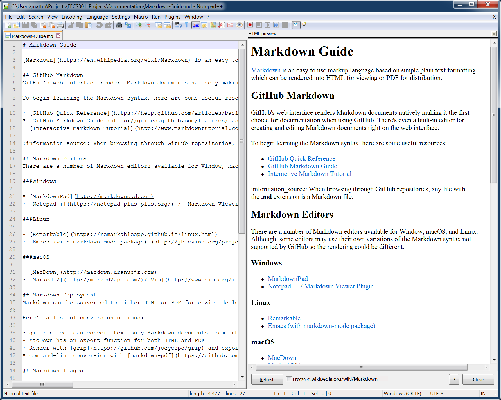

# Notepad++ Markdown Plugin for Windows

Notepad++ is a notepad replacement for Windows that works great for quick code and configuration file editing.  The plugin feature allows functionality additions to be developed.  


## Install Notepad++

Notepad++ can be download here: [Download](https://notepad-plus-plus.org/download/)

Check to make sure you download the correct version (either 32-bit or 64-bit) for your machine.

## Install PreviewHTML plugin

Download the PreviewHTML plugin from here: [Download](http://chiselapp.com/user/vor0nwe/repository/npp_preview/home)

Open the zip file and copy the **PreviewHTML.dll** to the `C:\Program Files (x86)\Notepad++\plugins` directory.

Open Notepad++ (restart if it was open)

From the menubar, select the **Plugins** -> **PreviewHTML** -> **Edit filter definitions**, then add the PreviewHTML filter to **filters.ini**:

```
; Content of Filters.ini file
[Markdown]
Extension=.md
Language=Markdown
Command=python -m markdown "%1"
```

## Install Python (if not installed)

If you don't have Python installed, you'll need to install it.

You can check to see if it's installed from the command line by running `python --version`

```
C:\>python --version
Python 2.7.6
```

Download the installer from here: [Download](https://www.python.org/downloads/windows/)

Make sure to get the latest Python 2.7 version.

You have to add Python to the PATH environment variable.

1. Open the **Windows Control Panel** from the Start menu
2. Select **System and Security**
3. Select **System**
4. Click **Advanced System Settings** on the left sidebar
5. Click the **Environment Variables** button near the bottom of the dialog
6. Hi-lite **Path** in the **System Variables**, then click the **Edit** button underneath
7. At the end of the existing **Path**, add `C:\Python27` and `C:\Python27\scripts` making sure to separate the entries with a `;`
8. Click Ok
9. Click Ok
10. Click Ok
11. Close the Control Panel

You should now be able to run `python --version` successfully from the command prompt.  (Note: you'll need to restart the command prompt after you change the path before the changes will take effect)

## Install Python Markdown Package

From the command promt, run 

```
C:\>pip install markdown
```

This installs the markdown parser for python

## Test Notepad++ with Markdown

Open a Markdown formatted document (the file should end with .md)

Enable the preview window, **Plugins** -> **PreviewHTML** -> **PreviewHTML**

You should see a window popup with the Markdown preview (might take a few seconds to update after opening)

You can dock the Preview Window to make it easier to use.


