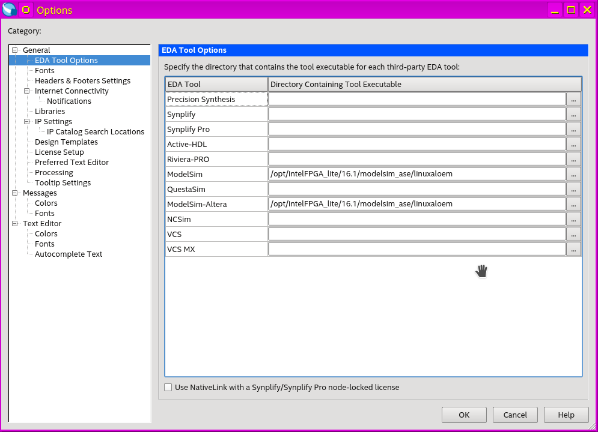

# Quartus Setup Guide

## Downloading the Quartus Installer

The Quartus v15.1 Installer files for both Linux and Windows are available from the class Google Drive.

Download the files listed for your OS:

* **For Windows**: [Quartus v15.1 Windows](https://drive.google.com/drive/u/1/folders/0B3gj26Jx7aigTVdXYl9DMm5ES28)
  * QuartusSetup-15.1.0.185-windows.exe
  * QuartusSetup-15.1.2.193-windows.exe 
  * ModelSimSetup-15.1.0.185-windows.exe
  * cyclonev-15.1.0.185.qdz

* **For Linux**: [Quartus v15.0.2 Linux](https://drive.google.com/drive/u/1/folders/0B3gj26Jx7aigODZFeWRvMXVELWc)
  * QuartusSetup-15.0.2.153-linux.run
  * Quartus-15.0.0.145-linux.tar
  * Quartus-15.0.0.145-devices-1.tar

## Install Process

### For Windows: 

Run: **QuartusSetup-15.1.0.185-windows.exe**

### For Linux (Ubuntu 16.04LTS): 

From a command shell run: `QuartusSetup-15.0.2.153-linux.run`

After the Quartus install completes, there are additional packages that need to be installed for ModelSim to provide 32-bit runtime support.

Run this install commands

```
$ sudo dpkg --add-architecture i386
$ sudo apt-get update
$ sudo apt-get install build-essential 
$ sudo apt-get install gcc-multilib g++-multilib lib32z1 lib32stdc++6 lib32gcc1
$ sudo apt-get install libc6:i386 libstdc++6:i386 libncurses5:i386 libxft2:i386 libxext6:i386 expat:i386 fontconfig:i386 libfreetype6:i386 libexpat1:i386 libgtk-3-0:i386 libcanberra0:i386 libpng12-0:i386 libice6:i386 libsm6:i386 zlib1g:i386 libx11-6:i386 libxau6:i386 libxdmcp6:i386 libxrender1:i386 libxt6:i386 libxtst6:i386
```

There is also a bug work around that needs to be done for ModelSim:

1. Select **Tools** -> **Options...** from the menu bar
2. Click **EDA Tool Options** on the left hand panel
3. Copy the path from the **ModelSim-Altera** box to the **ModelSim** box
4. Click **OK** to save the changes

Your entry for the path additions should look like this:



Add Quartus and ModelSim to the enviroment path by adding the following lines to the end of your `~/.bashrc` file (the install path to Quartus may be different on your machine):

```
export LM_LICENSE_FILE=""
export PATH=${PATH}:/opt/intelFPGA_lite/16.1/quartus/bin
export PATH=${PATH}:/opt/intelFPGA_lite/modelsim_ase/linuxaloem
```

Note: the modelsim path should have the _ase and NOT the _ae in it (want the Starter Edition)
KUbuntu install on my laptop was set to be put in /opt, so the 
modelsim path should be /opt/altera/15.0/modelsim_ase/linuxaloem

USB Blaster II Configuration requires the following setup:

1. Create the file **/etc/udev/rules.d/92-usbblaster.rules** to fix the udev permissions using nano, and adding the following lines...
	
	```
	$ sudo nano /etc/udev/rules.d/92-usbblaster.rules
	
	# USB-Blaster
	BUS=="usb", SYSFS{idVendor}=="09fb", SYSFS{idProduct}=="6001", MODE="0666"
	BUS=="usb", SYSFS{idVendor}=="09fb", SYSFS{idProduct}=="6002", MODE="0666" 
	BUS=="usb", SYSFS{idVendor}=="09fb", SYSFS{idProduct}=="6003", MODE="0666"   
	
	# USB-Blaster II
	BUS=="usb", SYSFS{idVendor}=="09fb", SYSFS{idProduct}=="6010", MODE="0666"
	BUS=="usb", SYSFS{idVendor}=="09fb", SYSFS{idProduct}=="6810", MODE="0666"
	```

2. Next, install the 32-bit udev library and create symlink for the older revision:

	```
	$ sudo apt-get update && sudo apt-get install libudev1:i386
	$ sudo ln -sf /lib/x86_64-linux-gnu/libudev.so.1 /lib/x86_64-linux-gnu/libudev.so.0
	```

3. Reboot

4. You should now be able to run jtagconfig and see the USB Blaster (make sure the USB cable to connected to the DE1-SoC board and the board is powered on):

	```
	$ sudo ~/intelFPGA_lite/16.1/quartus/bin/jtagconfig
	1) DE-SoC [1-2]
	  4BA00477   SOCVHPS
	  02D120DD   5CSE(BA5|MA5)/5CSTFD5D5/..
	```
	
5. If you received the `1) DE-SoC` message then the Programmer function properly.


## License Server

Connect to the CWRU license server to register Quartus:

1. From the Quartus menu, select **Tools** -> **License Setup...**

1. In the **License File** box enter: _1800@cse-lic-03_

1. The set of 4 (total) licensed cores should update.


