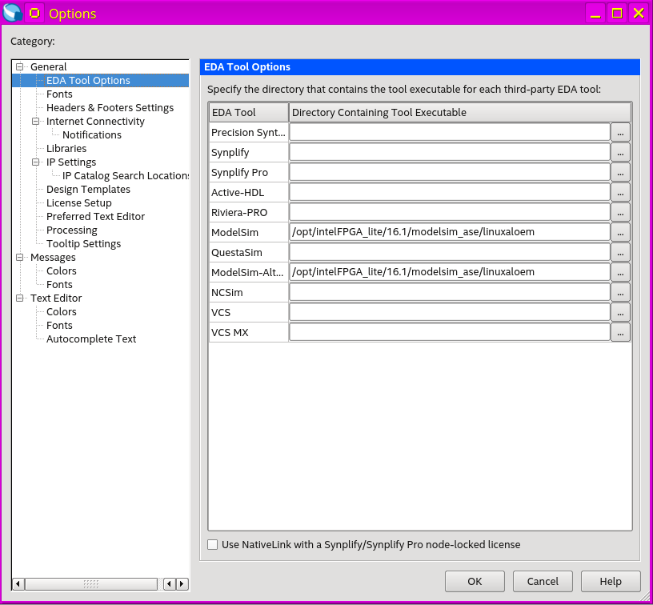

# Quartus Setup Guide

## Downloading the Quartus Installer

The Quartus v16.1 Installer files for both Linux and Windows are available from the class Google Drive.  There are distro's of the free WEB version as well as the full Licensed version.

Download the files listed for your OS:

* **For Windows Web Version**: [Quartus II Ver 16.1 Windows](https://drive.google.com/drive/folders/0B3gj26Jx7aigTmdLQ1U1YW5Vejg)
```
QuartusLiteSetup-16.1.0.196-windows.exe
cyclonev-16.1.0.196.qdz
QuartusHelpSetup-16.1.0.196-windows.exe
QuartusSetup-16.1.2.203-windows.exe
ModelSimSetup-16.1.0.196-windows.exe
```
* **For Linux Web Version**: [Quartus II Ver 16.1 Linux ](https://drive.google.com/drive/folders/0B3gj26Jx7aigc042LUtIYTNQbEU)

I would recommend using the Free Web version so you don't have to be logged into the Case Network every time you use Quartus and have to get a license key to run it (i.e. working off of the CWRU secure network).  When you need it, logging in on the secure Case Network WILL get you access for the license server to work (license server is only needed for later labs utilizing IP cores, etc.). So this way you can use it either way. Kinda nice when working off-campus on labs.

The distro is available to you on the shared Google Drive - the full licensed version is available as well.  The free  web version:
```
QuartusLiteSetup-16.1.0.196-linux.run
ModelSimSetup-16.1.0.196-linux.run
cyclonev-16.1.0.196.qdz
QuartusSetup-16.1.2.203-linux.run
```

* Quartus 16.1 Web  files and associated MD5 Sums
*
* Quartus Prime (includes Nios II EDS)
* Size: 2.0 GB MD5: 0FFD781FCC23C6FABC6A68019B3CAB62
* `File: QuartusLiteSetup-16.1.0.196-linux.run`
*
* ModelSim-Intel FPGA Edition (includes Starter Edition)
* Size: 1.1 GB MD5: F665D7016FF793E64F57B08B37487D0E
* File: ModelSimSetup-16.1.0.196-linux.run
*
* Cyclone V device support
* Size: 1.1 GB MD5: 8386E6891D17DC1FAF29067C46953FC7
* `File: cyclonev-16.1.0.196.qdz`
*
* Software and IP Updates (Latest)
* Quartus Prime Software v16.1 Update 2
* *You must have the base software installed before installing the update.
* Size: 2.4 GB MD5: 607E5CBFF6B674034413E675655DDA32
* `File: QuartusSetup-16.1.2.203-linux.run`
*

## Install Process

### For Windows: 
```
Run: QuartusLiteSetup-16.1.0.196-windows.exe
Run: QuartusHelpSetup-16.1.0.196-windows.exe
Run: ModelSimSetup-16.1.0.196-windows.exe
Run: QuartusSetup-16.1.2.203-windows.exe
```


### For Linux (Ubuntu 16.04LTS): 

After Downloading the 4 files to your machine, make sure they are each marked as executable, So, in a command shell:
```
sudo chmod +x QuartusLiteSetup-16.1.0.196-linux.run
sudo chmod +x ModelSimSetup-16.1.0.196-linux.run
sudo chmod +x cyclonev-16.1.0.196.qdz
sudo chmod +x QuartusSetup-16.1.2.203-linux.run
```

Then from the same command shell run the install program: 

`sudo ./QuartusLiteSetup-16.1.0.196-linux.run`

Choose to install it in the /opt directory (not a good idea to install it in your /home/username directory...)

If all the downloaded files are in the same directory, it will install all 4 files (including the updates) for you.
You should now be running Quartus II Ver 16.1.2 Build 203

After the Quartus install completes, there are additional packages that need to be installed for ModelSim to provide 32-bit runtime support.

Run this install commands

```
$ sudo dpkg --add-architecture i386
$ sudo apt-get update
$ sudo apt-get install build-essential 
$ sudo apt-get install gcc-multilib g++-multilib lib32z1 lib32stdc++6 lib32gcc1
$ sudo apt-get install libc6:i386 libstdc++6:i386 libncurses5:i386 libxft2:i386 libxext6:i386 expat:i386 fontconfig:i386 libfreetype6:i386 libexpat1:i386 libgtk-3-0:i386 libcanberra0:i386 libpng12-0:i386 libice6:i386 libsm6:i386 zlib1g:i386 libx11-6:i386 libxau6:i386 libxdmcp6:i386 libxrender1:i386 libxt6:i386 libxtst6:i386
```

There is also a bug work around that needs to be done for ModelSim:

1. Select **Tools** -> **Options...** from the menu bar
2. Click **EDA Tool Options** on the left hand panel
3. Copy the path from the **ModelSim-Altera** box to the **ModelSim** box
4. Click **OK** to save the changes

Add Quartus and ModelSim to the enviroment path by adding the following lines to the end of your `~/.bashrc` file (the install path to Quartus may be different on your machine):

```
export LM_LICENSE_FILE=""
export PATH=${PATH}:/opt/intelFPGA_lite/16.1/quartus/bin
export PATH=${PATH}:/opt/intelFPGA_lite/modelsim_ase/linuxaloem
```

Note: the modelsim path should have the _ase and NOT the _ae in it (want the Starter Edition)
KUbuntu install on my laptop was set to be put in /opt, so the 
modelsim path should be `/opt/intelFPGA_lite/modelsim_ase/linuxaloem`

Your entry for the path additions should look like this:




USB Blaster II Configuration requires the following setup:

1. Create the file **/etc/udev/rules.d/92-usbblaster.rules** to fix the udev permissions using nano, and adding the following lines...
	
	```
	$ sudo nano /etc/udev/rules.d/92-usbblaster.rules
	
	# USB-Blaster
	BUS=="usb", SYSFS{idVendor}=="09fb", SYSFS{idProduct}=="6001", MODE="0666"
	BUS=="usb", SYSFS{idVendor}=="09fb", SYSFS{idProduct}=="6002", MODE="0666" 
	BUS=="usb", SYSFS{idVendor}=="09fb", SYSFS{idProduct}=="6003", MODE="0666"   
	
	# USB-Blaster II
	BUS=="usb", SYSFS{idVendor}=="09fb", SYSFS{idProduct}=="6010", MODE="0666"
	BUS=="usb", SYSFS{idVendor}=="09fb", SYSFS{idProduct}=="6810", MODE="0666"
	```

2. Next, install the 32-bit udev library and create symlink for the older revision:

	```
	$ sudo apt-get update && sudo apt-get install libudev1:i386
	$ sudo ln -sf /lib/x86_64-linux-gnu/libudev.so.1 /lib/x86_64-linux-gnu/libudev.so.0
	```

3. Reboot

4. You should now be able to run jtagconfig and see the USB Blaster (make sure the USB cable to connected to the DE1-SoC board and the board is powered on):


`sudo /opt/intelFPGA_lite/16.1/quartus/bin/jtagconfig'`

in my .bashrc file (located in /home/username directory), I added the following to make an alias to check the USB programmer is linked in correctly (vad = View Altera Devboard):

`alias vad='sudo /opt/intelFPGA_lite/16.1/quartus/bin/jtagconfig'`


So when you type vad, your results should look similiar to this:
```
	$ sudo /opt/intelFPGA_lite/16.1/quartus/bin/jtagconfig
or 	$ vad
	1) DE-SoC [2-1.3]
           4BA00477   SOCVHPS
           02D120DD   5CSE(BA5|MA5)/5CSTFD5D5/..
```	
5. If you received the `1) DE-SoC` message then the DE1-SoC USB Programmer is functioning properly.


## License Server

Connect to the CWRU license server to register Quartus:

1. From the Quartus menu, select **Tools** -> **License Setup...**

1. In the **License File** box enter: _1800@cse-lic-03_

1. The set of 4 (total) licensed cores should update showing 20 seats for each license.

It should look like this:


