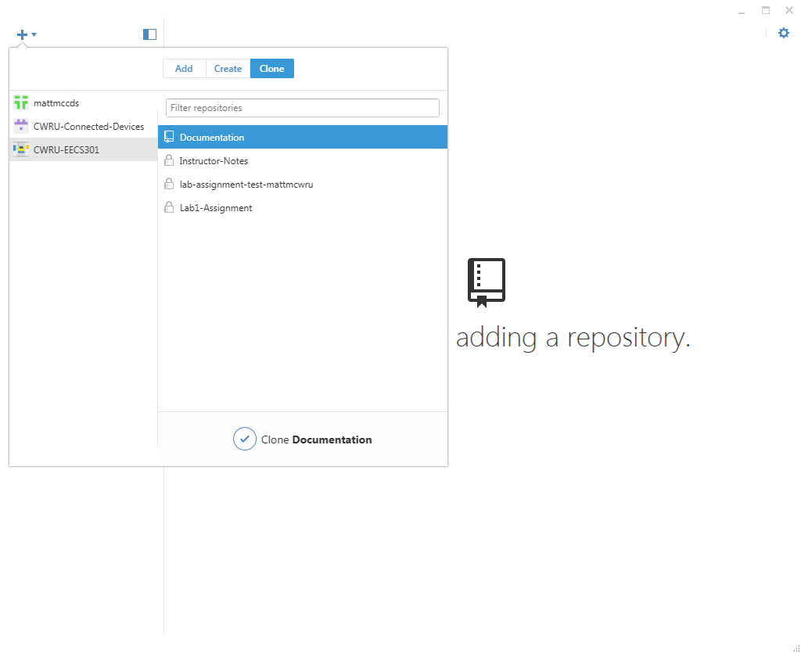

# Starting Guide to [GitHub](https://github.com)

## Introduction
**[Git](https://git-scm.com)** is a distributed version control system which was initially developed to manage the Linux kernel development.  GitHub is a web-based Git repository hosting service which enhances Git with additional project management and collaboration tools.  

GitHub hosted projects can be easily browsed and managed over the web but can also be accessed from Git client applications, such as GitHub Desktop, via SSH or HTTPS.

This guide will focus on setting up your GitHub account, installing a Git client application on your development machine and cloning the Documentation repo from the class GitHub repository.

## Version Control Basics
We'll be using GitHub for all class projects.  GitHub is a hosting service for Git repositories which provides both direct Git access (via SSH or HTTPS) and a very useful web front-end. There are many online resources for both Git and GitHub, a few of which we'll list here.

If you've never used a version control system (VCS) before, start here with this guide...
[About Version Control](https://git-scm.com/book/en/v2/Getting-Started-About-Version-Control)

If you've used a VCS before but not Git, skip to here in the guide to get an overview of Git...
[Git Basics](https://git-scm.com/book/en/v2/Getting-Started-Git-Basics)

---

:information_source: As a student, you should consider using GitHub (or a similar service) not only for this class but for all of your classes.  At minimum, it provides a remote backup of all your work in case of a catastrophic event but there are many other benefits:

* Storing class work in a repository organizes everything into a centralized location
* Retain the history of all your files in case you lose something you needed
* Save scanned handouts, tests, notes, etc to have a paperless archive
* Access your work from any computer
* Gain a valuable skill, used in many fields, to list on your résumé
* Easier collaboration management for group projects

GitHub's [Student Developer Pack](https://education.github.com/pack) offers unlimited private repositories and many other tools free for students.

---

## GitHub Account Setup

Follow this guide to setup your free GitHub account: [GitHub Account Setup](https://git-scm.com/book/en/v2/GitHub-Account-Setup-and-Configuration)

* Pick a professional username (something you'd feel fine listing on a résumé)
* Use your CWRU email account (to be eligible for the Student Developer Pack)
* Choose the **Free** signup option
* Make sure to setup an SSH key for your account: [Connecting to GitHub with SSH](https://help.github.com/articles/connecting-to-github-with-ssh/)  
	:warning: **Warning:** Be aware that private keys are **not** secure if you are using a public lab machine.

After your personal account is setup:

1. Email your GitHub username to the instructor so you can be added to the class GitHub Student Team
1. Run thought the [hello-world](https://guides.github.com/activities/hello-world/) tutorial to learn how GitHub works 
1. Optionally, signup for GitHub's [Student Developer Pack](https://education.github.com/pack) (although it's not required for this course)

## Setting Up Your Development Machine

To get started you'll need to configure your machine to use Git.  The setup varies depending on the operating system and each OS has a number of options.  

Skip to the OS section that applies for your machine:

### Windows / macOS(OS X)

[GitHub Desktop](https://desktop.github.com) is available for Windows and Mac and provides both a GUI and command-line tools.  This will be the **recommended option** for this class but feel free to use any other tools available.  Some options are 
[GitKraken](https://www.gitkraken.com),
[SourceTree](https://www.atlassian.com/software/sourcetree) and
[TortoiseGit](https://tortoisegit.org).

Follow this guide for setting up GitHub Desktop: 
[Getting Started with GitHub Desktop](https://help.github.com/desktop/guides/getting-started/)

**Note:** On Windows, there are two applications installed.  The **GitHub Desktop** GUI application and the **Git Shell** command-line interface.  The command-line interface **Git Shell** is probably the easier of the two options to use for your normal workflow.  When setting up SSH key access you'll want to use **Git Shell**.

### macOS(OS X)

If you have Xcode installed, you should already have the Git application available from the terminal.  (If Xcode isn't installed, do **not** install it just for Git, it's huge.)

The Xcode version of Git is (mostly) the same as the Linux version so see the Linux section for details.

### Linux

All the major linux distributions have a command-line **git** package that can be installed easily.  For Debian-based distros (e.g. Ubuntu):

```shell
$ sudo apt-get install git-all
```

After installing **git**, there are a number of configuration steps that need to be run only once:

* Set your username and email address

	```
	$ git config --global user.name "YOUR NAME"
	$ git config --global user.email "YOUR EMAIL ADDRESS"
	```

* Select the default push behavior

	```
	$ git config --global push.default simple
	```

* Set your editor for commit comments

	```
	$ git config --global core.editor "nano"
	```

## Configuring Command-Line Git SSH Access

When running Git from a command-line app (either **Git Shell** on Windows or **Terminal** on Linux/macOS) with an SSH remote, SSH will need to know which private SSH key to use for the host.  This host information can be set in the SSH config file.

First, check your Git remote to make sure you're using SSH connecting to GitHub (indicated by **git@github.com**):

```
$ git remote -v
origin	git@github.com:CWRU-EECS301/Documentation.git (fetch)
origin	git@github.com:CWRU-EECS301/Documentation.git (push)
```

On Linux and macOS, the SSH **config** file is stored at ~/.ssh/config for each user.  
When using **Git Shell** on Windows, it is also at ~/.ssh/config.

Edit the SSH **config** file to add GitHub host:

```
$ nano ~/.ssh/config
```

Add this **Host** definition to the file (assuming your private key for GitHub was named github_rsa):

```
Host github.com
    HostName github.com
    PreferredAuthentications publickey
    IdentityFile ~/.ssh/github_rsa
```

:warning: **WARNING:** Path names are case-sensitive.

To test your new configuration you can run the SSH test command:

```
$ ssh -T git@github.com
Hi user! You've successfully authenticated, but GitHub does not provide shell access.
```

:warning: **NOTE:** If you've added a password to your SSH key then you may need to add your key to SSH Agent using the command:

```
$ ssh-add ~/.ssh/github_rsa
```

---

### Multiple GitHub Profiles

:warning: **NOTE:** This shouldn't be needed for this class but if for some reason you have multiple accounts on GitHub...

The SSH **config** file can also be used to add multiple user profiles for GitHub by adding alternate **Host** entries:

```
Host alt.github.com
    HostName github.com
    PreferredAuthentications publickey
    IdentityFile ~/.ssh/alt_github_rsa
```

Your Git remote using your alternate profile will then be:

```
$ git remote -v
origin	git@alt.github.com:CWRU-EECS301/Documentation.git (fetch)
origin	git@alt.github.com:CWRU-EECS301/Documentation.git (push)
```

## Cloning from GitHub

A repository from GitHub can be cloned either using a client application (like GitHub Desktop) or directly from the command line.  Both methods will be demonstrated by cloning the **Documentation** repository from the EECS301 GitHub (viewable via web browser @ [https://github.com/CWRU-EECS301/Documentation](https://github.com/CWRU-EECS301/Documentation)).

### From the Command Line

Using the Git command line tool `git clone` we'll clone the **Documentation** repository into the directory EECS301 using SSH. (Skip to your OS section)

#### Windows

Launch **Git Shell** which was installed with GitHub Desktop.

```
C:\> cd .\Projects\EECS301
C:\Projects\EECS301> git clone git@github.com:CWRU-EECS301/Documentation.git
```

#### Linux

From a terminal:

```
$ cd EECS301
$ git clone git@github.com:CWRU-EECS301/Documentation.git
```

#### macOS (OSX)

From a terminal:

```
$ cd EECS301
$ git clone git@github.com:CWRU-EECS301/Documentation.git
Cloning into 'Documentation'...
remote: Counting objects: 3040, done.
remote: Compressing objects: 100% (39/39), done.
remote: Total 3040 (delta 14), reused 0 (delta 0), pack-reused 2993
Receiving objects: 100% (3040/3040), 158.68 MiB | 1.79 MiB/s, done.
Resolving deltas: 100% (1682/1682), done.
Checking connectivity... done.
Checking out files: 100% (3980/3980), done.
```

### From the GitHub Desktop

Once you've been added to the EECS301 GitHub Team and you have linked your GitHub account to GitHub Desktop, you'll be able to clone repositories from the repository list as show below:

<kbd>

</kbd>
